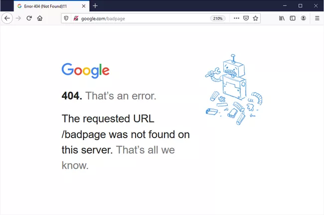

# Session 1 Notes

## Plan for Today
> 1. [Install Python IDE, packages](Python_IDE_Setup.md)
> 2. Understanding HTTP, interacting with API
> 3. Set up API credentials
> 4. Live coding to pull tweets
    - What Elon Musk tweeted
    - What kind of tweets that Taylor Swift liked
    - Tweets related to ND Sports with hashtag #GoIrish
    - What are people talking about Justice Breyer's retirement (Time Permitting)


## HTTP and 404
>  #### What is HTTP protocol?
>  Client Request - Server Response
>  #### How is HTTP related to Twitter API?
>  The data pulling through Twitter API follows HTTP protocol. It is very useful for debugging when the API returns error message.
> #### Frequent HTTP Status Code:
> 
> 1. Successful responses: 200(Successful)
> 2. Client error response: 401(Unauthorized), 403(Forbidden), 404(Not Found)
     - Response Status Code starting with 4 means the client end has error(s).
     - Check the request detail
> 3. Server error response: 500(Internal Server Error), 503(Service Unavailable)
     - Response Status Code starting with 5 means the server end(Twitter Server) has error(s).
     - Nothing you can do about it, wait and retry

## Tweet Cap and Rate Limit
> **Twitter Limits How Much and How Frequent You Can Request Data**
> 1. [Monthly Tweet Cap](https://developer.twitter.com/en/portal/dashboard)
> 2. [Rate Limit](https://developer.twitter.com/en/portal/products)

## Packages Import
> 1. [Tweepy](https://docs.tweepy.org/en/stable/getting_started.html): the package to build connection to Twitter API
> 2. [Pandas](https://pandas.pydata.org/docs/getting_started/overview.html): the package for data processing

## Example 1: Pull Elon Musk's Timeline
   [Elon Musk Tweets](https://twitter.com/elonmusk)

   > - There is a cap of 3200 tweets for pulling a certain user's timeline.
   > - Each request allows a maximum of 100 tweets, use for loop to send multiple requests.
   > - To pull more than 3200 tweets of user's timeline, use search_all_tweets and query operators.

## Tweet API Basics
  > 1. By default, the API only returns the ```id``` and the ```text``` fields.
  > 2. Tweepy Response

        - ```data```
        - ```error```
        - ```includes```
           * ```user```
           * ```tweet```
        - ```meta```
  > 3. Request additional fields
    - ```author_id```
    - ```context_annotations```
    - ```conversation_id```
    - ```created_at```
    - ```entities```
    - ```in_reply_to_user_id```
    - ```public_metrics```
    - ```referenced_tweets```
  > * [Full Twitter Fields and Explanation](https://developer.twitter.com/en/docs/twitter-api/data-dictionary/object-model/tweet)
  > 4. Expansions
    * To request the reference tweets data. Referenced tweets are quoted tweets or the tweets that are replied to.
    * An example:
  >   
  > 
  >
  > 

## Example 2: Pull Tweets Taylor Swift Liked

   > - Allows you to get information about a user’s liked Tweets.
   > - use function **get_liked_tweets**

## Example 3: Pull Tweets Contains #GoIrish

   > - use **search_recent_tweets()** (essential or elevated account)
     - allow to pull data within the last 7 days
   > - or use search_all_tweet() (academic research account)
     - allow to pull the full-archive data of twitter, back to 2006
   > - Simple query: hashtag only

## Example 4: Pull Tweets about Justice Breyer's Retirement

   > - use **search_recent_tweets()** (essential or elevated account)
     - allow to pull data within the last 7 days
   > - or use search_all_tweet() (academic research account)
     - allow to pull the full-archive data of twitter, back to 2006
   > 1. Building Query
        - ```keyword```
        - ```"exact phrase match"```
        - ```#```
        - ```@```
        - ```from:	```
        - ```to:```
        - ```conversation_id:```
        - ```is:retweet```
        - ```is:quote```
        - ```negation```
> 2. Specify Periods
    - Date and time format (ISO 8601/RFC 3339) with 24h-clock. UTC timezone.
      - ``` YYYY-MM-DDTHH:mm:ssZ ```
      - ``` 2022-01-31T00:00:01Z ```
      - ``` 2022-02-01T23:59:59Z ```
    - Note the date specified above is in UTC timezone, you will need to convert time from local time to UTC
      - e.g. ```ET 2022-01-31 00:00:01``` -> ```UTC 2022-01-31T05:00:01Z```
  > * [Full Query Parameters](https://developer.twitter.com/en/docs/twitter-api/tweets/search/integrate/build-a-query)


### End

  ####  [Submit questions and issues here](https://github.com/Lucy-Family-Institute/CSSR-Workshop-Twitter/issues) ####
